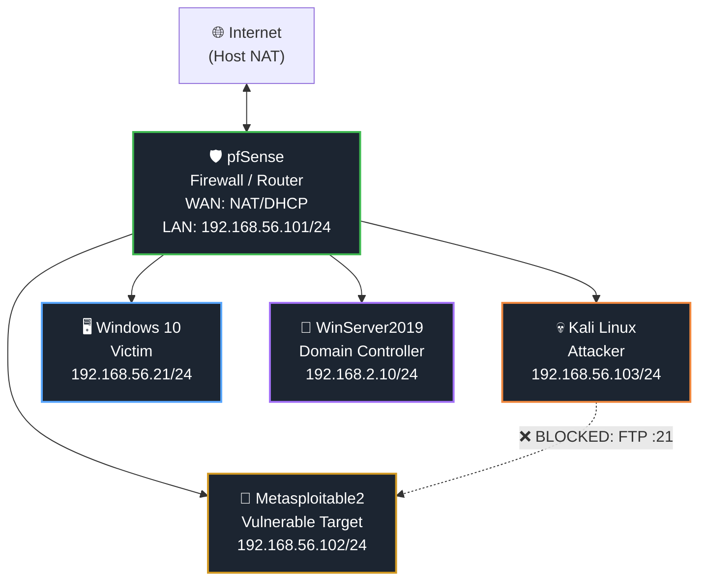

[README.md](https://github.com/user-attachments/files/30680501/README.md)
# cybersecurity-home-lab-Isolated-environment-
pentest-lab-pfsense-metasploitable
# Personal Cybersecurity Homelab

A fully isolated, virtualized cybersecurity lab built with VirtualBox, used to practice network segmentation, Active Directory administration, firewall policy enforcement, and offensive security techniques in a safe, contained environment.

## Lab Overview

| Component | Role | IP Address |
|---|---|---|
| **pfSense** | Firewall / Router | WAN: NAT · LAN: `192.168.56.101/24` |
| **Kali Linux** | Attacker | `192.168.56.103/24` |
| **Windows 10** | Victim workstation | `192.168.56.21/24` |
| **Metasploitable2** | Intentionally vulnerable target | `192.168.56.102/24` |
| **Windows Server 2019** | Domain Controller (AD DS + AD CS) | `192.168.2.10/24` |

All VMs run in Oracle VirtualBox on isolated/internal networks, with **pfSense acting as the router and firewall** between segments — nothing in this lab touches my physical home network.

---

---

---

## Phase 1 — Lab Environment Setup

Building out the VirtualBox inventory: attacker, victims, and infrastructure VMs, each on their own virtual disk and network adapter.

| Screenshot | Description |
|---|---|
| `01-virtualbox-manager-overview.png` | VirtualBox Manager showing the full VM inventory (Kali, WinServer2019, Windows 10, Metasploitable, pfSense, CyberOps Security Onion) with the Hard Disk Selector open, confirming all virtual disks are correctly attached. |
| `02-metasploitable2-extracted-files.png` | Extracted Metasploitable2 archive (`.vmdk`, `.vmx`, `.nvram`) ready to be imported as a VM. |
| `03-new-vm-wizard-windows10.png` | Creating the Windows 10 victim VM — naming it and selecting the OS type/version in the New Virtual Machine wizard. |
| `04-pfsense-nat-adapter-settings.png` | pfSense VM network Adapter 1 set to **NAT**, so the firewall itself can reach the internet (for updates) via its WAN interface. |
| `05-winserver2019-bridged-adapter-settings.png` | Windows Server 2019 VM Adapter 1 set to **Bridged Adapter**, used during initial Domain Controller setup before final network placement. |

> Each VM was deliberately isolated using VirtualBox internal/host-only networking, with pfSense acting as the router/firewall between segments.

---

## Phase 2 — pfSense Firewall Deployment

Standing up pfSense as the gateway for the lab and troubleshooting the initial configuration.

| Screenshot | Description |
|---|---|
| `01-pfsense-console-boot-interface-assignment.png` | pfSense console after boot, showing interface assignment: `WAN (em0)` on NAT/DHCP, `KALI (em1 / LAN)` statically set to `192.168.56.101/24`. This is the core network map for the lab. |
| `02-pfsense-wan-lan-interfaces-detail.png` | Close-up of the WAN/LAN interface assignment output. |
| `03-ie-blocked-pfsense-gui.png` | Internet Explorer Enhanced Security Configuration blocking access to the pfSense web GUI (`192.168.56.101`) from the Windows Server VM — a config step I had to work around. |
| `04-pfsense-dhcp-no-static-ip-error.png` | pfSense DHCP Server page warning: *"This system has no interfaces configured with a static IPv4 address"* — documenting a step that had to be fixed before DHCP would serve clients. |
| `05-domain-join-tutorial-dns-config.png` | Tutorial reference (Cyberwox Academy guide) for pointing pfSense's DHCP DNS setting to the Domain Controller (`192.168.2.10`) and setting the domain name (`CYBERWOX.local`) so clients could resolve and join the domain. |

---

## Phase 3 — Active Directory Domain Controller Setup

Standing up Active Directory Domain Services (AD DS) and Certificate Services (AD CS) on Windows Server 2019.

| Screenshot | Description |
|---|---|
| `01-shutdown-event-tracker.png` | Windows Shutdown Event Tracker after an unexpected VM restart mid-configuration. |
| `02-adcs-adds-roles-installed.png` | Server Manager dashboard confirming both **AD CS** and **AD DS** roles installed, with a pending "Post-deployment Configuration" flag for AD CS. |
| `03-post-deployment-config-notice.png` | Close-up of the AD CS post-deployment configuration notification. |
| `04-powershell-installaddsforest-failure.png` | Attempted domain promotion via PowerShell (`Install-ADDSForest -DomainName "yourdomain.local"`), which failed with a parameter error (`'NewDomain' was not recognized`). Pivoted to the GUI wizard after this. |
| `05-adds-wizard-already-dc-error.png` | AD DS Configuration Wizard error encountered while adding the server as a DC for `CyberGuardian.local`: *"target server is already a domain controller."* |
| `06-adcs-configuration-wizard-credentials.png` | AD CS Configuration Wizard — Credentials step, configuring the Certificate Authority role on `CyberGuardian-SAM.CyberGuardian.local`. |
| `07-firewall-off-pfsense-gateway-tutorial.png` | Disabling Windows Firewall (lab-only, not recommended in production) while following the tutorial steps to set pfSense as the Domain Controller's default gateway (`192.168.2.10` / gateway `192.168.2.1`). |
| `08-tutorial-checkpoint.png` | Checkpoint marker showing where I paused in the tutorial, for resuming the walkthrough later. |
| `09-network-and-internet-settings-check.png` | Verifying Control Panel network settings applied correctly on the Domain Controller. |

---

## Phase 4 — Network Connectivity Verification

Confirming full Layer 3 connectivity across the lab segment and performing initial reconnaissance with Nmap before any exploitation.

| Screenshot | Description |
|---|---|
| `01-initial-ping-50pct-loss.png` | Initial `ping 192.168.56.101` from Windows Server showing intermittent "Destination host unreachable" (50% packet loss) — an early routing/interface issue that had to be resolved. |
| `02-pfsense-interface-assignments.png` | pfSense Interface Assignments page: WAN (`em0`) and Kali/LAN (`em1`) mapped to their NICs, with a third port (`em2`) available/unused. |
| `03-kali-ip-a-output.png` | Kali `ip a` output confirming its address on the lab segment (`192.168.56.103/24`). |
| `04-metasploitable-ifconfig.png` | Metasploitable2 `ifconfig` output confirming its address (`192.168.56.102`). |
| `05-nmap-host-discovery-sweep.png` | `nmap -sn 192.168.56.0/24` host discovery sweep — 4 hosts found up (`.100`, `.101`, `.102`, `.103`). |
| `06-kali-ping-tests-all-hosts.png` | Kali successfully pinging pfSense (`.101`) and Metasploitable (`.102`), 0% packet loss. |
| `07-windows10-ping-tests-all-hosts.png` | Windows 10 `cmd` ping tests to `.102`, `.103`, and `.101` all succeeding — confirming full connectivity across the segment. |
| `08-nmap-detailed-scan-metasploitable.png` | `nmap -sV -A 192.168.56.102` — detailed scan revealing FTP (vsftpd 2.3.4), SSH, Telnet, and SMTP. This scan reveals the vulnerable FTP backdoor exploited in Phase 6. |
| `09-nmap-detailed-scan-windows10.png` | `nmap -sV -A 192.168.56.21` — scan showing SMB stack (135/139/445), NetBIOS name, and OS fingerprinted as Windows. |
| `10-nmap-scan-host-down-retry.png` | Nmap initially reporting the Windows 10 host as down (blocking ping probes) and retrying with `-Pn`. |
| `11-nmap-scan-attempts-log.png` | Terminal log of the sequence of scans run against `.100`–`.103` during the recon phase. |
| `12-nmap-scan-full-subnet.png` | `nmap -sV -Pn` sweep across the full `/24` subnet plus a targeted scan of the Windows 10 host. |
| `13-port-scan-ftp-open-verification.png` | Targeted `nmap -p21` and `nc -zv` checks confirming Metasploitable's FTP port is open before exploitation. |

---

## Phase 5 — Network Segmentation & Firewall Rule Testing

Proving that pfSense firewall rules actually enforce policy between segments — not just building the lab, but validating it.

| Screenshot | Description |
|---|---|
| `01-firewall-rules-block-kali-to-metasploitable.png` | pfSense firewall rule set on the KALI interface: anti-lockout rule, a rule **blocking Kali → Metasploitable FTP (`:21`)**, and default allow rules. |
| `02-firewall-rule-edit-detail.png` | Detail view of the block rule — Action: Block, Interface: KALI, Protocol: TCP, Source `192.168.56.103/32`, Destination `192.168.56.102/32`. |
| `03-firewall-logs-deny-hits-set1.png` | pfSense firewall logs showing repeated "Default deny rule IPv4" hits as Kali's traffic to port 80/21 gets blocked — proof the rule is active. |
| `04-firewall-logs-deny-hits-set2.png` | Additional log entries, including blocked UDP/DHCP broadcast traffic and further TCP attempts. |
| `05-firewall-logs-deny-hits-set3.png` | Further confirmation of blocked traffic across a longer time span. |
| `06-reset-firewall-state-table.png` | Diagnostics → Reset States page — clearing pfSense's firewall state table so new rule changes take effect immediately. |
| `07-kali-outbound-internet-blocked.png` | Kali unable to reach the internet (`ping: connect: Network is unreachable`, later 100% packet loss to `8.8.8.8`) — demonstrating an outbound-block rule keeping Kali contained to the isolated lab segment. |
| `08-kali-internet-unreachable-then-lan-ok.png` | Kali confirming internet access is blocked while LAN traffic to pfSense/Metasploitable still works normally. |
| `09-firewall-rule-disabled-internet-restored.png` | Disabling the outbound-block rule and confirming Kali regains internet/DHCP access — set up for the exploitation demo in Phase 6. |
| `10-firewall-log-outbound-block-confirmed.png` | pfSense syslog explicitly confirming the "Block KALI OUTBOUND TO INTERNET (DEMO)" rule firing repeatedly before it was disabled. |

> This phase demonstrates that network segmentation isn't just configured — it's *validated* with before/after firewall log evidence.

---

## Phase 6 — Exploitation with Metasploit

Using the reconnaissance from Phase 4 to exploit the vulnerable targets, including one full compromise and two honestly-documented failed attempts.

| Screenshot | Description |
|---|---|
| `01-smb-enumeration-access-denied.png` | Initial `smbclient -L` against Windows 10 (`192.168.56.21`) failing with `NT_STATUS_ACCESS_DENIED` on anonymous session setup; `enum4linux -a` kicked off next. |
| `02-enum4linux-results.png` | `enum4linux -a` results — RID range, known usernames, and successful NetBIOS/workgroup enumeration (`WORKGROUP`, `CYBERSAM`). |
| `03-smbclient-nbtstat-verification.png` | `nbtstat` and further `smbclient` session attempts confirming host services but no valid anonymous SMB session. |
| `04-ms17-010-module-load-attempt.png` | Metasploit console startup and initial attempt to load the `smb_ms17_010` scanner module. |
| `05-eternalblue-not-vulnerable.png` | `auxiliary/scanner/smb/smb_ms17_010` and `exploit/windows/smb/ms17_010_eternalblue` both reporting the target is **not vulnerable** — an honest "it didn't work" result showing real methodology, not a cherry-picked win. |
| `06-msf-console-ms17-010-scanner.png` | Metasploit console (v6.1.27-dev) setting `RHOSTS` and running the MS17-010 scanner against `192.168.56.21`. |
| `07-psexec-credential-failure.png` | `windows/smb/psexec` attempt with `SMBUser TEST-SAM` and a guessed password failing with `STATUS_LOGON_FAILURE` (invalid credentials). |
| `08-psexec-service-start-issues.png` | Later `psexec` attempts with valid credentials authenticating successfully but the service failing to start (`ACCESS_DENIED` / timeout) before eventually succeeding. |
| `09-psexec-success-meterpreter-system-shell.png` | **`psexec` succeeds** — Meterpreter session opened. `sysinfo` confirms `CYBERSAM`, Windows 10 Build 19045; `getuid` confirms **`NT AUTHORITY\SYSTEM`**. |
| `10-vsftpd-backdoor-exploit-root-shell.png` | `exploit/unix/ftp/vsftpd_234_backdoor` against Metasploitable2 (`192.168.56.102`) — backdoor shell spawned, `whoami` confirms **`root`**. |

---

## Key Takeaways

- Built a fully isolated multi-VM lab (attacker, two victims, firewall, and domain infrastructure) using only VirtualBox networking — no exposure to the host network.
- Configured pfSense as a real perimeter firewall and **validated** segmentation with firewall logs, not just rule screenshots.
- Stood up Active Directory (AD DS + AD CS) on Windows Server 2019, troubleshooting real-world PowerShell and GUI wizard errors along the way.
- Performed structured reconnaissance (Nmap host discovery → service/version scanning) before any exploitation attempt.
- Achieved full compromise of Metasploitable2 via the `vsftpd` backdoor and of the Windows 10 host via `psexec`, while documenting failed EternalBlue and credential-guessing attempts for methodological honesty.

## Tools Used

`VirtualBox` · `pfSense 2.8.1` · `Kali Linux 2022.1` · `Metasploitable2` · `Windows Server 2019` · `Windows 10` · `Nmap` · `Metasploit Framework v6.1.27` · `enum4linux` · `smbclient`
